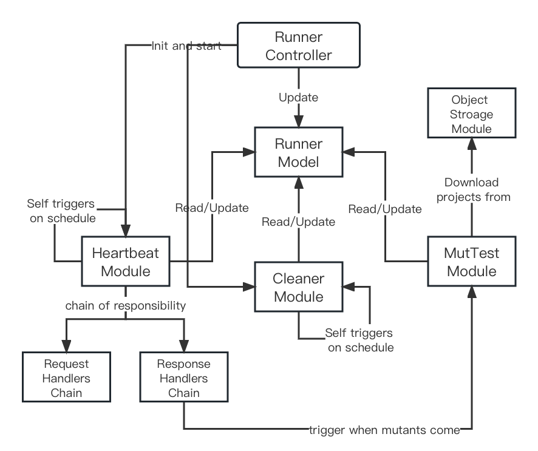

# Runner-PoC followup

This document introduces the Proof-of-Concept (PoC) of the runner NestJS [implementation](https://github.com/ISEP-Mutator-Orchestrator/runner-poc), including the architecture design, some implementation details of specific modules, and future follow-up work that can be done based on this implementation.

## The architecture of the runner
The architecture of the runner is shown in the figure below.

The **runner controller** is responsible for initializing the runner, including runner registration to the orchestrator, starting the heartbeat and project cleaner. The status of the runner will be saved in the singleton instance of RunnerModel. After initialization, the runner will be orchestrated by the orchestrator.

The **heartbeat module** will regularly send a request to the orchestrator, reporting runner status. And all the command from the orchestrator will be sent to the runner through the response of this heartbeat. This mechanism is designed in case the runner doesn't have a public IP address or behind a gateway or firewall. 

To construct the request DTO and handle the commands in the response DTO, the **chain of responsibility pattern** is used by creating a set of handlers. The whole task will be pass through a customized handler chain and each handler only handle the sub-task that they can handle. The request handlers are responsible for collecting all kinds of status of the runner and construct the request DTO. The response handlers are responsible for dividing the task from the orchestrator and trigger different runner jobs.

The **cleaner module** will regularly clean the directories that used to save the projects. If the project is no longer usable, it will delete the project.

The **mutation testing (MutTest) module** is used to execute the mutant. It is a dummy implementation and will be left for future development.

The **object storage module** is used to download the projects from object storage service providers.

### Runner model

In our design, the runner should be light-weight and stateless, which means the runner should be a singleton software and shouldn't have any external system dependencies. It should work like a state machine, updating its state by listening the commands from the orchestrator, and the functional modules do their jobs based on the state changes.

In our case, the runner model is the state of the runner. An observer pattern can be used to de-couple the architecture of this state machine. All the functional modules can subscribe the runner model and get notified when the state changes. The ideal use cases looks like this:

- The security module will register itself when the runnerId is missing in the model, update the JWT token saved in the model when expired, and deregister itself when the status of the runner in the model is changed to 'shutdown' mode.
- The cleaner module will clean the projects that are not shown in the model.
- The request handlers will trigger some other modules to update the runner status and information in the model, and construct the heartbeat requests based on the info shown in the model.

In this proof-of-concept, this state machine design is far from complete. The observer pattern haven't been implemented, no security module currently provided, and the request handlers construct the request DTO based on mock data.

### Heartbeat module

The heartbeat module is one of the most important modules of this runner. This module will regularly send a request to the orchestrator, reporting runner status. And all the command from the orchestrator will be sent to the runner through the response of this heartbeat. This mechanism is designed in case the runner doesn't have a public IP address or behind a gateway or firewall. 

To construct the request DTO and handle the commands in the response DTO, the chain of responsibility pattern is used by creating a set of handlers. The whole task will be pass through a customized handler chain and each handler only handle the sub-task that they can handle. The request handlers are responsible for collecting all kinds of status of the runner and construct the request DTO. The response handlers are responsible for dividing the task from the orchestrator and trigger different runner jobs.

The request handlers includes the followings, the task will be pass on order:

1. RequestBaseHandler
2. RequestRunnerStatusHandler: handle runner status, currently using mock data
3. RequestRunnerFrameworkHandler: handle available frameworks that the runner support, currently using mock data.

The response handlers include the followings on order:

1. ResponseBaseHandler: check if it is a valid response
2. ResponseMutantHandler: trigger the execution process of the mutant.

### Mutation testing module

A dummy implementation of executing process of the mutants, including receiving the task, downloading the project if needed, running the mutant, and uploading the result.

### Cleaner module

Regularly delete the unused saved projects on schedule.

### Object storage module

A dummy implementation of an object storage service client, the architecture reserves some room for supporting all kind of object service SDKs, currently we only implemented a S3 compatible one for Minio.

